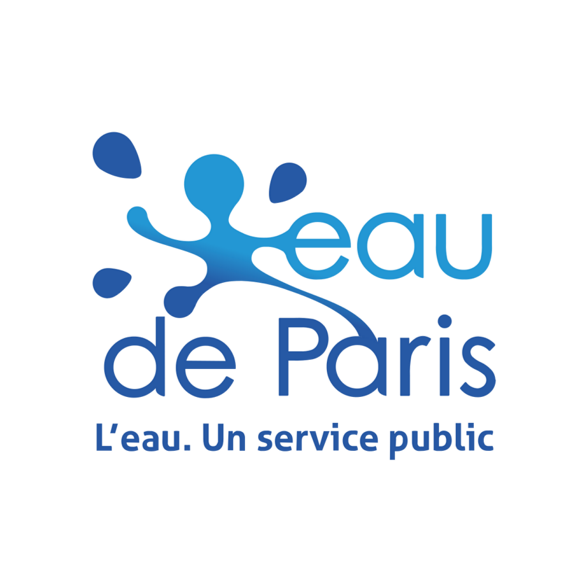
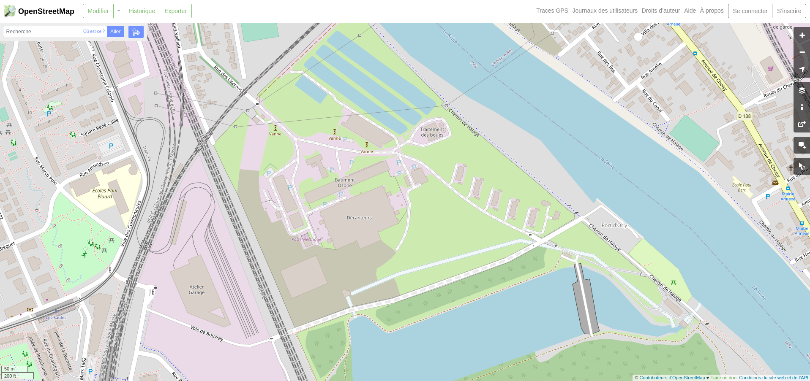

layout: true
  

`r paste0("
", params$event, " 

")`

---
class:center, middle

.mini[]

pour

---
class: center, middle

Ces slides en ligne : `r paste0("http://datactivist.coop/", params$slug)`

Sources : `r paste0("https://github.com/datactivist/", params$slug)`

Les productions de Datactivist sont librement réutilisables selon les termes de la licence [Creative Commons 4.0 BY-SA](https://creativecommons.org/licenses/by-sa/4.0/legalcode.fr).

 
 

---
class: inverse, center, middle

# C'est quoi l'open data ?

---
class: inverse, center, middle

# D'abord, c'est quoi les données ?

---
## La pyramide Data-Information-Knowledge-Wisdom

.pull-left[

]

.pull-right[Attribuée à [Russell Ackoff](http://en.wikipedia.org/wiki/Russell_L._Ackoff), 1989

Les données peuvent être des :

- faits
- signaux/stimulis
- symboles]

---
## La pyramide Data-Information-Knowledge-Wisdom

- Les **.red[données]** sont la matière "brute" d'où naît l'information.

- **.red[L'information]** pourrait être définie comme des données qui ont été consignées, classées, organisées, raccordées ou interprétées dans un cadre qui en dégage le sens.

- En donnant du sens à de l'information, on obtient de la **.red[connaissance]**.

- En donnant du sens à la **.red[connaissance]** on obtient du savoir.

---
## La mise en données du monde

- Concrètement, aujourd'hui, quels aspects de nos vies sont mis en données ?

--

- Recherches internet, pratiques sportives, consommation énergie, régime alimentaire, trajets dans les transports en commun...

- Cette mise en donnée est rendue possible par le développement de .red[**capteurs**] qui viennent collecter et agréger ces données 

--

- Recherches internet .red[(cookies)], pratiques sportives .red[(montres connectées)], consommation énergie .red[(compteurs connectés)], régime alimentaire .red[(appli type Yuka)], trajets dans les transports en commun .red[(Pass Navigo)]...

- La question devient peut-être, *quels aspects de votre vie ne sont pas (encore) mis en données ?*

---
class: inverse, center, middle

# Et l'open data donc ?

---
## Des données que chacun peut .red[réutiliser librement] 

L'open data, ou données ouvertes, ce sont :

- des .red[données]

--

- le plus souvent produites par des acteurs .red[publics]

--

- librement accessibles, modifiables et réutilisables (juridiquement - .red[licences])

--

- effectivement accessibles, modifiables et réutilisables (techniquement - .red[*machine readable*])

*Pour en savoir plus : https://opendefinition.org/od/1.1/fr/*

---
## Un .red[cadre légal] spécifique

L'open data se construit comme .red[mouvement international] depuis les années 2000 (Conférence de Sebastopol en 2007). 

En France, le mouvement a commencé au niveau local (Rennes dès 2010) puis a rapidement été repris au niveau national (création de la [mission Etalab](https://www.etalab.gouv.fr/) en 2011). 

En 2016, la .red[Loi pour une République numérique] pose comme principe .red[l'ouverture par principe des données publiques] - en ménageant la .red[protection] de certaines données (personnelles, défense nationale, propriété intellectuelle, secret des affaires, sécurité...). 

Si l'open data est désormais une .red[obligation], c'est avant tout une .red[opportunité] à saisir par les acteurs publics et privés ! 

---
## De l'open data aux données protégées... .red[un large spectre]

---
## Et chez Eau de Paris ?

- des .red[obligations légales] : la loi pour une République numérique, notamment pour les données publiques et les données environementales.

- le choix d'.red[aller au-delà], pour l'innovation, les partenaires territoriaux et la défense de la place de la consommation d'eau du robinet face à l'embouteillage majoritairement plastique.

---
## Et chez Eau de Paris ?

L'inventaire des fontaines à boire accessibles sur le domaine public

---
## Et chez Eau de Paris ?

Des données également diffusées via le SI Eau / SISPEA

---
class: inverse, center, middle

# Mais alors, à quoi ça sert l'open data ?

### Sept choses qui n'auraient pas existé sans l'open data

---
class: inverse, center, middle

# 1. Yuka

.center[]

---
## Yuka 

.reduite[.center[]]

---
## Yuka 

### 8,5 millions d'utilisateurs
### 2 millions de produits scannés chaque jour
### Top 10 des applis gratuites sur l'Appstore et le Playstore

---

[.center[]](https://fr.openfoodfacts.org/decouvrir)

---
class: inverse, center, middle

# 2. Startups d'État

---

## beta.gouv.fr

[.center[]](https://beta.gouv.fr/startups)

---

## Au commencement était data.gouv.fr

.center[]

---
class: inverse, center, middle

# 3. Pokemon go 

.center[]

---

[.center[]](https://teamopendata.org/t/pokemon-go-migre-sur-openstreetmap/113)

---
class: inverse, center, middle

# 4. La base adresses nationale

---

---
class: inverse, center, middle

# 5. Une carte de la pollution de l'air dans les écoles

---

## Merci AirParif !

---

---
class: inverse, center, middle

# 6. Les applis de mobilité

---
## Les applis de mobilité

.center[.reduite[]]

---
class: inverse, center, middle

# 7. La cartographie collaborative

---
## Google Maps

---
## OpenStreetMap

---
## OpenStreetMap

---
## OpenStreetMap

Et même 7 116 bornes à incendie

---
class: inverse, center, middle

# Des opportunités pour Eau de Paris ?

### Eau de Paris peut aussi contribuer à ces .red[biens communs]

---
## Rendre les usages de l'eau plus lisibles ?

S'inspirer des données d'énergies pour proposer .red[une vision similaire] pour l'eau

---
## Expérimenter avec l'eau non potable ?

Le double réseau parisien offre l'opportunité d'expérimenter sans enjeu de sensibilité

---
class: inverse, center, middle

# Merci !

## Vos questions ?

Contacts : 
[joel@datactivist.coop](mailto:joel@datactivist.coop)
[francois@datactivist.coop](mailto:francois@datactivist.coop)

